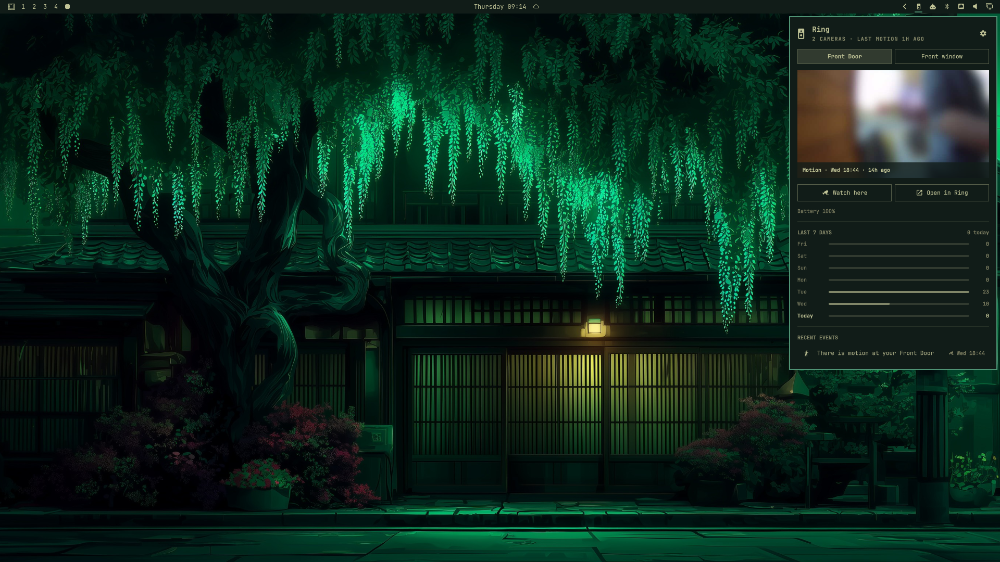
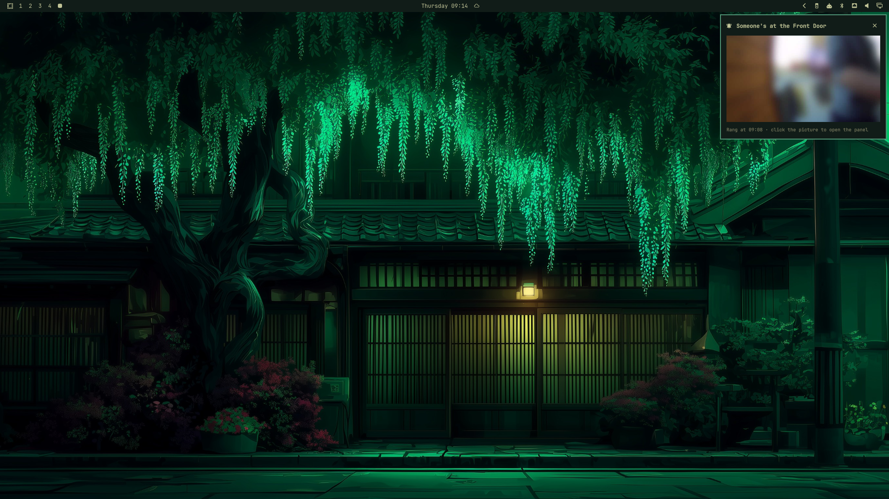
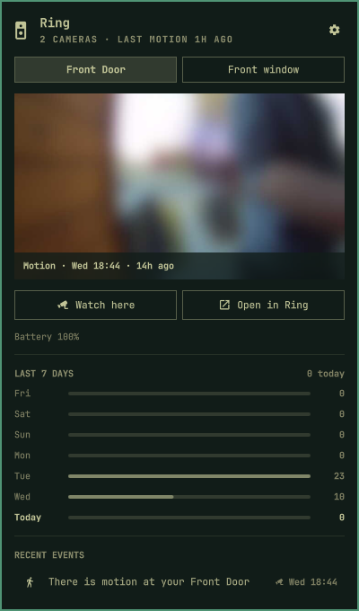
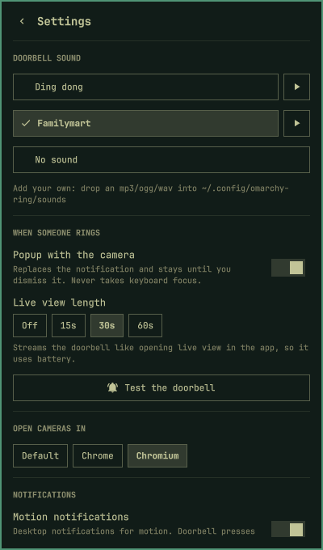
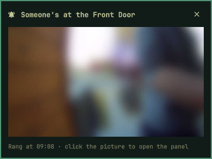

# omarchy-ring

Your Ring cameras in the [Omarchy](https://omarchy.org) bar: motion and doorbell
events with snapshots, a live view right in the panel, and a doorbell popup that
plays a chime without stealing your keyboard.

> **Unofficial.** Not affiliated with, endorsed by, or supported by Ring or Amazon.
> It talks to Ring through [ring-client-api](https://github.com/dgreif/ring), an
> unofficial library that Ring can break at any time.





<p>
  
  
  
</p>

## What it does

- **Bar icon** that lights up when something new happened. Left-click opens the
  panel, right-click opens Ring in the browser, middle-click switches camera.
- **Panel** in the same style as Omarchy's own panels:
  - a tab per camera, with the latest snapshot
  - **Watch here**: a live view inside the panel (video only, ~3 fps)
  - **Open in Ring**: the camera's page on ring.com, in the browser you pick
  - the last 7 days at a glance and a list of recent events; hover or `j`/`k`
    through them to see each event's snapshot
- **Doorbell**: a chime and a small popup with the live view. The popup never
  takes keyboard focus and stays until you dismiss it.
- **Motion notifications** on the desktop (can be turned off).
- **Settings** (the cog, or `s`): doorbell sound with preview, popup and live
  view length, browser, notifications, restart/reload/logs, log out.

Keys in the panel: `h`/`l` camera · `j`/`k` events · `w` watch live · `o` open in
browser · `s` settings · `Esc` back/close.

## Install

You need Omarchy, `ffmpeg`, and Node **20, 22 or 24** (ring-client-api doesn't
support newer ones yet; with mise: `mise install node@24`).

```bash
omarchy plugin add https://github.com/nathanmeira/omarchy-ring.git
~/.config/omarchy/plugins/nnathan.ring/install.sh
omarchy-ring-login
```

`omarchy plugin add` only copies the widget; Omarchy never runs install scripts
for you, so `install.sh` sets up the background service. Read it first, it's
short. Then log in with the Ring account that **owns** the cameras (email,
password, 2FA code). The widget picks it up within a few seconds.

To remove it: `~/.config/omarchy/plugins/nnathan.ring/uninstall.sh`, then
`omarchy plugin remove nnathan.ring`.

## How it works

```
Ring cloud ──push──▶ omarchy-ring service (Node, sandboxed systemd user unit)
                       ├─ ~/.local/state/omarchy-ring/state.json   events, cameras, status
                       ├─ …/snapshots/*.jpg                        event thumbnails
                       └─ …/live/*.jpg                             live view frames
                                  ▲ watches                ▼ request.json (live, stop, …)
                       nnathan.ring widget (QML inside the Omarchy shell)
```

The widget never talks to Ring; it only draws the files the service writes, like
Omarchy's own Agents widget.

## Security and privacy

- **The saved login opens your Ring account.** `omarchy-ring-login` stores a
  refresh token in `~/.config/omarchy-ring/refresh-token` (mode 600), never
  printed. Anyone who can read that file can see your cameras.
- **The service is sandboxed**: it sees an empty home folder except its own code,
  config and state, and only Ring's servers plus Google's push service (how Ring
  delivers real-time events).
- **Pinned dependencies**: ring-client-api is pinned to an exact version and
  installed with install scripts disabled.
- **Revoking**: *Log out* in the settings view deletes the token on your machine.
  To cut access on Ring's side too, remove "omarchy-ring" under ring.com →
  Control Center → Authorized Client Devices.
- Snapshots and events stay on your machine and are deleted after 7 days.

## Resource use

Measured on a 12-core desktop:

| | CPU | Memory |
|---|---|---|
| Idle (waiting for events) | ~0.05% of one core | ~60 MB |
| During a live view | ~55% of one core (1440p decode) | ~240 MB |

Live views end when you close the popup or the panel, or after their set length.

## Known limits

- **Shared Users don't work** right now: Ring doesn't list their cameras through
  this API ([dgreif/ring#1808](https://github.com/dgreif/ring/issues/1808)). Log
  in with the owner account.
- The in-panel live view is video only, about 3 frames per second. Use
  *Open in Ring* for sound and full quality.
- Ring's website may ask for your password before every Live View. That's
  Ring's check, not this widget.
- Live views on battery cameras use battery, like opening live view in the app.

## Sounds

Drop any `.mp3`, `.ogg`, `.wav`, `.flac`, `.m4a` or `.opus` into
`~/.config/omarchy-ring/sounds/` and pick it in the settings view. The bundled
`ding-dong.ogg` is an original chime (MIT, like the rest).

## Troubleshooting

- Logs: *Settings → View logs*, or `journalctl --user -u omarchy-ring -f`
- Restart the service: *Settings → Restart service*, or `systemctl --user restart omarchy-ring`
- Widget not updating after an edit: *Settings → Reload widget* (`omarchy restart shell`)

## License

MIT
